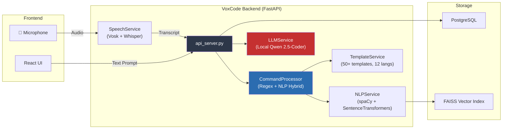
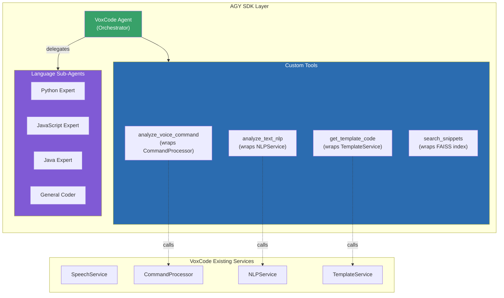
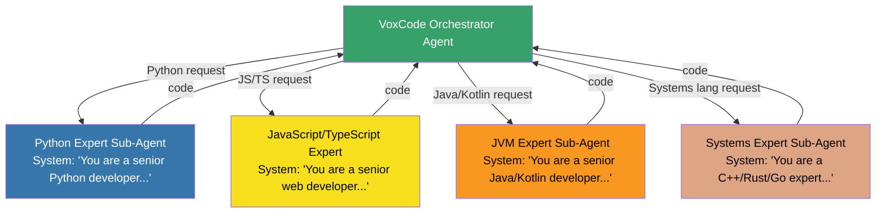
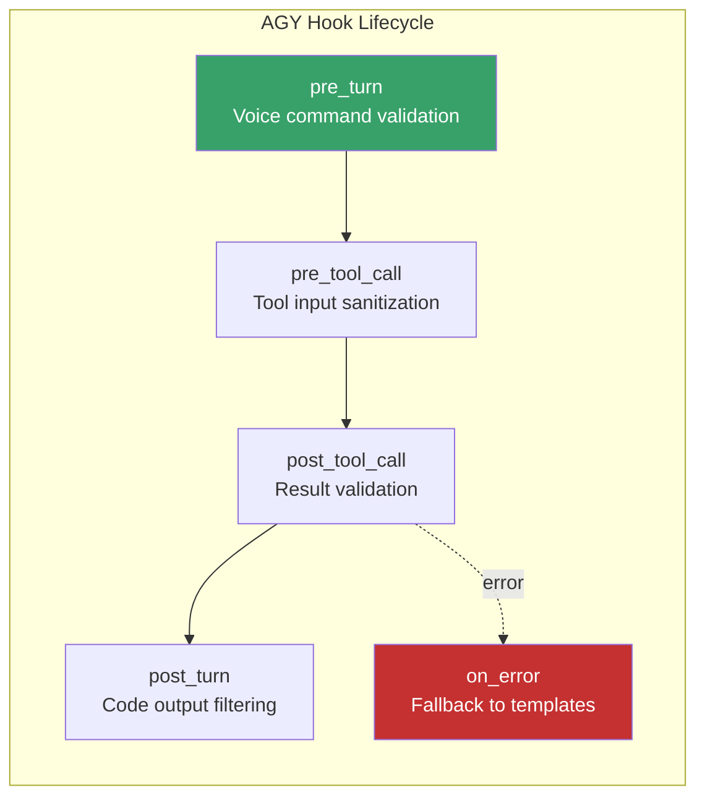
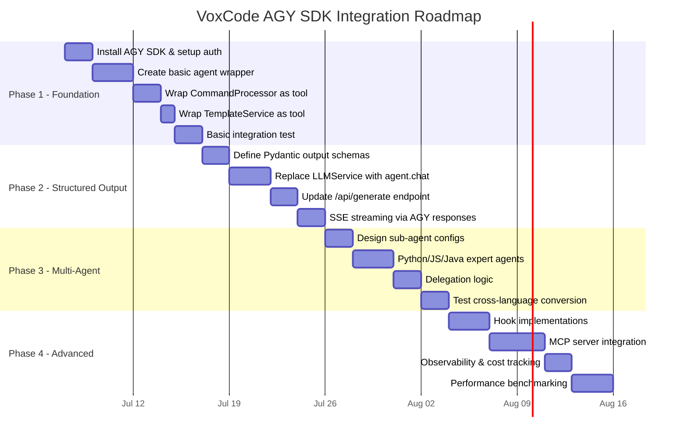

# VoxCode × Google Antigravity (AGY) SDK — Integration Plan

> **Author:** AI Integration Specialist  
> **Date:** 2026-07-05  
> **Status:** Draft — Awaiting Review  
> **VoxCode Version:** Backend (FastAPI + Python)  
> **AGY SDK Version:** `google-antigravity` (latest PyPI)

---

## Table of Contents

1. [Executive Summary](#1-executive-summary)
2. [Feasibility Assessment](#2-feasibility-assessment)
3. [Current VoxCode Architecture](#3-current-voxcode-architecture)
4. [Architecture Mapping — VoxCode → AGY Concepts](#4-architecture-mapping)
5. [Custom Tools Design](#5-custom-tools-design)
6. [Multi-Agent Architecture](#6-multi-agent-architecture)
7. [Structured Output](#7-structured-output)
8. [MCP Integration](#8-mcp-integration)
9. [Hooks — Pre/Post Processing](#9-hooks)
10. [Implementation Roadmap](#10-implementation-roadmap)
11. [Risk Assessment](#11-risk-assessment)
12. [Appendix — File Reference](#12-appendix)

---

## 1. Executive Summary

VoxCode is a voice-to-code assistant with a mature pipeline: **Voice → SpeechService → CommandProcessor → NLPService → TemplateService/LLMService → Code**. The Google Antigravity (AGY) SDK provides a framework for building autonomous AI agents with custom tools, multi-agent orchestration, structured output, hooks, and MCP connectivity.

**Key Conclusion:** The AGY SDK is a strong fit for **replacing and enhancing the LLM orchestration layer** of VoxCode. It will not replace the specialized speech, NLP, or template engines — those remain as custom tools the AGY agent calls. The primary benefits are:

- **Unified agent orchestration** replacing ad-hoc `httpx` streaming to a local model server
- **Multi-agent delegation** for language-specific code generation
- **Structured output** ensuring code responses are machine-parseable
- **Hook system** for voice-command preprocessing and security guardrails
- **MCP integration** for connecting to external code analysis tools (linters, formatters, LSPs)

---

## 2. Feasibility Assessment

### 2.1 What AGY SDK Can Do for VoxCode

| Capability | Benefit to VoxCode | Feasibility |
|---|---|---|
| **Agent with custom tools** | Wrap CommandProcessor, NLPService, TemplateService as tools the agent can call | ✅ High |
| **Structured output (Pydantic)** | Return code generation results as typed objects instead of raw text | ✅ High |
| **Multi-agent delegation** | Language-specific sub-agents (Python expert, Java expert, etc.) | ✅ High |
| **Hooks (pre/post turn, tool execution)** | Voice command validation, audit logging, profanity filtering | ✅ High |
| **MCP servers** | Connect to ESLint, Ruff, Prettier, or LSP servers for code analysis | ✅ Medium |
| **Streaming responses** | Replace manual SSE streaming with AGY's built-in token streaming | ✅ High |
| **Persistent memory** | Remember past coding sessions across conversations | ⚠️ Medium |
| **Cost/token observability** | Track Gemini API usage per user | ✅ High |

### 2.2 What AGY SDK Cannot Replace

| Current Component | Why It Stays |
|---|---|
| **SpeechService** (Vosk + Whisper) | AGY SDK has no audio/speech processing — this remains VoxCode's domain |
| **NLPService** (spaCy, SentenceTransformers, TextBlob) | Domain-specific spelling correction, coding abbreviation expansion, and FAISS-based semantic search are too specialized to replace with a generic LLM |
| **TemplateService** | 50+ handcrafted code templates across 12 languages — these are deterministic and fast; they become a tool the agent can optionally use |
| **PostgreSQL persistence** | AGY has its own persistence, but VoxCode's user/snippet database schema stays |
| **FastAPI server & auth** | AGY SDK is a library, not a web framework; the API layer stays |

### 2.3 Prerequisites

- **API Key:** `GEMINI_API_KEY` environment variable (obtain from [Google AI Studio](https://aistudio.google.com/app/api-keys))
- **Python:** 3.10+ (already met)
- **Package:** `pip install google-antigravity`
- **Async:** VoxCode already uses `async/await` in FastAPI — ✅ compatible

> [!IMPORTANT]
> The AGY SDK uses Gemini models by default. VoxCode currently uses a local Qwen 2.5-Coder via an OpenAI-compatible API. The migration means code generation shifts from a local model to Gemini (cloud), which has different latency, cost, and privacy implications. A **hybrid approach** is recommended: use AGY for orchestration while keeping the local LLM as a fallback tool.

---

## 3. Current VoxCode Architecture



### Current Pipeline (per `/api/generate` request)

1. **Input:** User sends `{prompt, language}` via REST or WebSocket
2. **CommandProcessor:** Hybrid regex + transformer intent detection → resolves intent (`CREATE`, `OPTIMIZE`, `EXPLAIN`, etc.), language, and template type
3. **TemplateService:** If intent is `CREATE` with high confidence, generates code from a local template
4. **LLMService:** Streams code via `httpx` to a local model server (OpenAI-compatible), with sanitization logic to strip markdown fences and thinking tokens
5. **Output:** SSE stream of code chunks back to the frontend

---

## 4. Architecture Mapping

### VoxCode → AGY Concepts



### Mapping Table

| VoxCode Component | AGY Concept | Mapping Strategy |
|---|---|---|
| `api_server.py` `/api/generate` | `Agent.chat()` | The endpoint creates an AGY agent, sends the prompt, streams the response |
| `CommandProcessor.process_transcript()` | Custom Tool `analyze_voice_command` | Agent calls this tool to understand intent/language/complexity before generating code |
| `NLPService.analyze_text()` | Custom Tool `analyze_text_nlp` | Agent calls this for spelling correction, keyword extraction, concept detection |
| `NLPService.search_snippets()` | Custom Tool `search_code_snippets` | Agent can search existing code snippets for context |
| `TemplateService.get_code()` | Custom Tool `get_template_code` | Agent can use templates for simple/known patterns instead of generating from scratch |
| `LLMService` (Qwen 2.5-Coder) | **Replaced** by AGY Agent's built-in Gemini model | The AGY agent IS the LLM — no separate model server needed |
| Intent-specific logic in `api_server.py` | Agent's system instructions + tool selection | The agent autonomously decides whether to use templates, generate code, or delegate |
| SSE streaming in endpoints | `async for token in response` | AGY SDK natively supports async token streaming |

---

## 5. Custom Tools Design

### 5.1 Tool: `analyze_voice_command`

Wraps `CommandProcessor.process_transcript()` — the agent's primary tool for understanding what the user wants.

```python
def analyze_voice_command(transcript: str, language: str = "text") -> dict:
    """
    Analyze a voice/text command to extract intent, target language,
    confidence score, and any pre-generated template code.
    
    Args:
        transcript: The raw voice transcript or text prompt from the user.
        language: The programming language context (e.g., 'python', 'javascript').
    
    Returns:
        A dictionary with keys: intent, language, confidence, template_type,
        generated_code, cleaned_prompt, and nlp_analysis.
    """
    from command_processor import CommandProcessor
    cp = CommandProcessor()
    return cp.process_transcript(transcript, language)
```

### 5.2 Tool: `analyze_text_nlp`

Wraps `NLPService.analyze_text()` — gives the agent deep NLP analysis.

```python
def analyze_text_nlp(text: str) -> dict:
    """
    Perform deep NLP analysis on text: spelling correction, abbreviation
    expansion, keyword extraction, code concept detection, dependency
    identification, and intent classification.
    
    Args:
        text: The text to analyze (voice transcript or code).
    
    Returns:
        Dictionary with corrected_text, keywords, code_concepts,
        dependencies, entities, and intent_classification.
    """
    from nlp_service import NLPService
    service = NLPService()
    return service.analyze_text(text)
```

### 5.3 Tool: `get_template_code`

Wraps `TemplateService.get_code()` — fast local code generation.

```python
def get_template_code(
    language: str,
    template_type: str,
    name: str = "result",
    params: str = "data",
    docstring: str = "TODO: Add description"
) -> str:
    """
    Generate code from a local template. Supports 12 languages and 50+
    template types including function, class, api, test, enum, quick_sort,
    binary_search, linked_list, react_comp, spring_crud, and more.
    
    Use this for common, well-known patterns where deterministic output
    is preferred over LLM generation.
    
    Args:
        language: Target language (python, javascript, typescript, java, cpp, etc.)
        template_type: Type of code to generate (function, class, api, test, etc.)
        name: Name for the generated entity.
        params: Parameter names.
        docstring: Documentation string.
    
    Returns:
        Generated source code as a string.
    """
    from template_service import TemplateService
    ts = TemplateService()
    return ts.get_code(language, template_type, name=name, params=params, docstring=docstring)
```

### 5.4 Tool: `search_code_snippets`

Wraps `NLPService.search_snippets()` — semantic code search.

```python
def search_code_snippets(query: str, top_k: int = 5) -> list[dict]:
    """
    Search saved code snippets using semantic similarity (FAISS vector index).
    Returns the most relevant previously-saved snippets matching the query.
    
    Args:
        query: Natural language description of what to search for.
        top_k: Maximum number of results to return.
    
    Returns:
        List of matching snippets with id, title, and language.
    """
    from nlp_service import NLPService
    service = NLPService()
    return service.search_snippets(query, top_k)
```

### 5.5 Tool Registration

```python
from google.antigravity import Agent, LocalAgentConfig

config = LocalAgentConfig(
    model="gemini-2.5-flash",
    system_instructions=VOXCODE_SYSTEM_PROMPT,
    tools=[
        analyze_voice_command,
        analyze_text_nlp,
        get_template_code,
        search_code_snippets,
    ],
)
```

---

## 6. Multi-Agent Architecture

### 6.1 Language-Specific Sub-Agents

For complex code generation, the main VoxCode agent delegates to language-specific sub-agents with tailored system instructions:



### 6.2 Delegation Strategy

The orchestrator agent decides when to delegate based on:

1. **Complexity:** Simple requests (confidence ≥ 0.6, known template) → use `get_template_code` tool directly
2. **Language specialty:** Complex Python code → delegate to Python Expert sub-agent
3. **Cross-cutting concerns:** "Convert this Python code to Rust" → delegate to Systems Expert with context from Python Expert

### 6.3 Sub-Agent Configuration Example

```python
python_expert_config = LocalAgentConfig(
    model="gemini-2.5-flash",
    system_instructions="""You are an elite Python developer. You specialize in:
    - Clean, idiomatic Python 3.10+ code
    - Type hints and dataclasses
    - FastAPI, Flask, SQLAlchemy, pytest
    - Async/await patterns
    
    OUTPUT ONLY SOURCE CODE. No markdown fences. No explanations.
    Match complexity to the request.""",
)
```

---

## 7. Structured Output

### 7.1 Code Generation Response Schema

Using Pydantic models to ensure the agent returns structured, parseable results:

```python
from pydantic import BaseModel, Field
from typing import Optional

class CodeGenerationResult(BaseModel):
    """Structured output for code generation responses."""
    
    code: str = Field(description="The generated source code")
    language: str = Field(description="Programming language of the code")
    intent: str = Field(description="Detected intent: CREATE, OPTIMIZE, EXPLAIN, etc.")
    title: str = Field(description="Short descriptive title for the code snippet")
    confidence: float = Field(
        ge=0.0, le=1.0,
        description="Confidence score of intent detection"
    )
    explanation: Optional[str] = Field(
        default=None,
        description="Brief explanation of what the code does (only for EXPLAIN intent)"
    )
    dependencies: list[str] = Field(
        default_factory=list,
        description="Required packages/imports (e.g., ['flask', 'sqlalchemy'])"
    )
    template_used: Optional[str] = Field(
        default=None,
        description="Name of the template used, if any"
    )
```

### 7.2 Usage with AGY SDK

```python
from google.antigravity import Agent, LocalAgentConfig

config = LocalAgentConfig(
    model="gemini-2.5-flash",
    system_instructions=VOXCODE_SYSTEM_PROMPT,
    tools=[analyze_voice_command, get_template_code, search_code_snippets],
    output_schema=CodeGenerationResult,  # Enforce structured output
)

async with Agent(config) as agent:
    response = await agent.chat("Create a Python async web scraper with aiohttp")
    result: CodeGenerationResult = await response.parsed()
    # result.code, result.language, result.dependencies are all typed
```

---

## 8. MCP Integration

### 8.1 Potential MCP Server Connections

| MCP Server | Purpose | Priority |
|---|---|---|
| **Ruff** (Python linter) | Auto-lint generated Python code before returning it | High |
| **ESLint** | Lint JavaScript/TypeScript output | Medium |
| **Prettier** | Format code output consistently | Medium |
| **File System** | Read/write project files when user says "add this to my project" | High |
| **Git** | Version control integration ("commit this code") | Low |

### 8.2 Configuration Example

```python
from google.antigravity import Agent, LocalAgentConfig, McpServerConfig

config = LocalAgentConfig(
    model="gemini-2.5-flash",
    tools=[analyze_voice_command, get_template_code],
    mcp_servers=[
        McpServerConfig(
            name="ruff",
            command="ruff",
            args=["server", "--stdio"],
            description="Python linter and formatter",
        ),
        McpServerConfig(
            name="filesystem",
            command="npx",
            args=["-y", "@anthropic/mcp-filesystem-server", "/workspace"],
            description="File system access for code output",
        ),
    ],
)
```

### 8.3 Realistic Constraint

> [!WARNING]
> MCP integration requires the MCP servers to be installed and available on the host system. This adds deployment complexity. **Recommendation:** Start without MCP servers (Phase 1-2), add them in Phase 3 only after the core agent integration is stable.

---

## 9. Hooks

### 9.1 Available Hook Points

The AGY SDK supports lifecycle hooks that are ideal for VoxCode's needs:



### 9.2 Hook Implementations

```python
# Pre-turn: Validate and clean voice input
async def pre_turn_hook(context):
    """Clean up voice transcript before the agent processes it."""
    prompt = context.message
    if len(prompt.strip()) < 3:
        return {"skip": True, "reason": "Input too short"}
    
    # Run NLP spelling correction
    from nlp_service import NLPService
    nlp = NLPService()
    corrected = nlp.correct_spelling(nlp.expand_abbreviations(prompt))
    context.message = corrected
    return context

# Post-turn: Strip any accidental markdown from code output
async def post_turn_hook(context):
    """Ensure code output is clean (no markdown fences)."""
    output = context.response
    if output and "```" in output:
        # Extract code from markdown fences
        lines = output.split("\n")
        code_lines = []
        in_block = False
        for line in lines:
            if line.startswith("```"):
                in_block = not in_block
                continue
            if in_block:
                code_lines.append(line)
        if code_lines:
            context.response = "\n".join(code_lines)
    return context

# On-error: Fall back to template-based generation
async def on_error_hook(context):
    """If the agent fails, fall back to local template generation."""
    from template_service import TemplateService
    ts = TemplateService()
    # Try to generate something useful from local templates
    fallback = ts.get_code(
        context.metadata.get("language", "python"),
        "function",
        name="generated_function",
        docstring=context.original_prompt
    )
    return {"fallback_code": fallback}
```

---

## 10. Implementation Roadmap

### Phase Overview



### Phase 1: Foundation (Week 1-2)

**Goal:** Basic AGY agent running alongside existing VoxCode pipeline.

| Task | Details | Risk |
|---|---|---|
| Install `google-antigravity` | Add to `requirements.txt`, verify import | Low |
| Set up `GEMINI_API_KEY` | Add to `.env`, update `config.py` | Low |
| Create `agy_agent_poc.py` | Basic agent with system instructions | Low |
| Wrap CommandProcessor | Custom tool `analyze_voice_command` | Low |
| Wrap TemplateService | Custom tool `get_template_code` | Low |
| Integration test | Agent can process "Create a Python function for factorial" end-to-end | Medium |

**Deliverables:** Working PoC at [agy_agent_poc.py](file:///X:/Voxcode/backend/agy_agent_poc.py)

### Phase 2: Structured Output & API Integration (Week 3-4)

**Goal:** Replace `LLMService` with AGY agent in production endpoints.

| Task | Details | Risk |
|---|---|---|
| Define `CodeGenerationResult` schema | Pydantic model for structured code output | Low |
| Replace `llm_service.stream_code()` | Use `agent.chat()` + async token streaming | Medium |
| Update `/api/generate` | Dual-mode: AGY agent (primary) + local LLM (fallback) | Medium |
| Update `/api/optimize` | Agent-based code optimization | Medium |
| Update `/api/explain` | Agent-based code explanation | Low |

### Phase 3: Multi-Agent System (Week 5-6)

**Goal:** Language-specific expert sub-agents for higher quality code.

| Task | Details | Risk |
|---|---|---|
| Design sub-agent system prompts | Language-specific expertise instructions | Low |
| Implement delegation logic | Orchestrator decides which sub-agent to use | Medium |
| Cross-language conversion | "Convert Python to Rust" via sub-agent handoff | Medium |
| Performance tuning | Optimize sub-agent spawn time | High |

### Phase 4: Advanced Features (Week 7-8)

**Goal:** Hooks, MCP, observability, and production hardening.

| Task | Details | Risk |
|---|---|---|
| Pre/post turn hooks | Voice input cleaning, output sanitization | Low |
| Error hooks | Graceful fallback to templates on failure | Low |
| MCP: Ruff integration | Auto-lint Python code output | Medium |
| Token usage tracking | Per-user Gemini API cost monitoring | Medium |
| Load testing | Benchmark agent response time vs local LLM | High |

---

## 11. Risk Assessment

### Technical Risks

| Risk | Impact | Mitigation |
|---|---|---|
| **Gemini API latency** | Code generation slower than local Qwen model | Hybrid approach: use templates for simple requests, agent for complex ones |
| **API key exposure** | Security vulnerability | Server-side only, never sent to frontend; use environment variables |
| **AGY SDK maturity** | Breaking changes in future versions | Pin SDK version, abstract behind an interface |
| **Cost at scale** | Gemini API costs grow with user base | Monitor token usage via observability hooks; implement per-user rate limiting |
| **Offline capability** | AGY needs internet; local LLM doesn't | Keep local LLM as fallback when Gemini is unreachable |

### Architectural Risks

| Risk | Impact | Mitigation |
|---|---|---|
| **Dual-model complexity** | Two code gen paths (AGY + local LLM) to maintain | Phase out local LLM once AGY is proven stable |
| **Sub-agent latency** | Multi-agent delegation adds overhead | Use sub-agents only for complex tasks; simple tasks use tools directly |
| **NLP service duplication** | Agent has its own NLP vs VoxCode's spaCy/TextBlob | Keep VoxCode's NLP for voice-specific tasks (spelling, abbreviations); let agent handle semantic understanding |

---

## 12. Appendix

### File Reference

| File | Role | AGY Impact |
|---|---|---|
| [api_server.py](file:///X:/Voxcode/backend/api_server.py) | FastAPI endpoints | Updated to call AGY agent instead of LLMService |
| [command_processor.py](file:///X:/Voxcode/backend/command_processor.py) | Intent detection + template resolution | Wrapped as AGY custom tool |
| [nlp_service.py](file:///X:/Voxcode/backend/nlp_service.py) | spaCy, SentenceTransformers, FAISS | Wrapped as AGY custom tool |
| [llm_service.py](file:///X:/Voxcode/backend/llm_service.py) | Local LLM streaming client | **Replaced** by AGY agent (kept as fallback) |
| [speech_service.py](file:///X:/Voxcode/backend/speech_service.py) | Vosk + Whisper audio pipeline | **Unchanged** — feeds into AGY agent |
| [template_service.py](file:///X:/Voxcode/backend/template_service.py) | 50+ code templates, 12 languages | Wrapped as AGY custom tool |
| [config.py](file:///X:/Voxcode/backend/config.py) | Configuration management | Add `GEMINI_API_KEY` config |
| [models.py](file:///X:/Voxcode/backend/models.py) | SQLAlchemy models | **Unchanged** |
| [agy_agent_poc.py](file:///X:/Voxcode/backend/agy_agent_poc.py) | **NEW** — AGY integration PoC | Phase 1 deliverable |

### Dependency Addition

```diff
# requirements.txt
+ google-antigravity
```

### Environment Variables

```env
# .env (new additions)
GEMINI_API_KEY=your-api-key-here
AGY_MODEL=gemini-2.5-flash
AGY_FALLBACK_ENABLED=true
```
